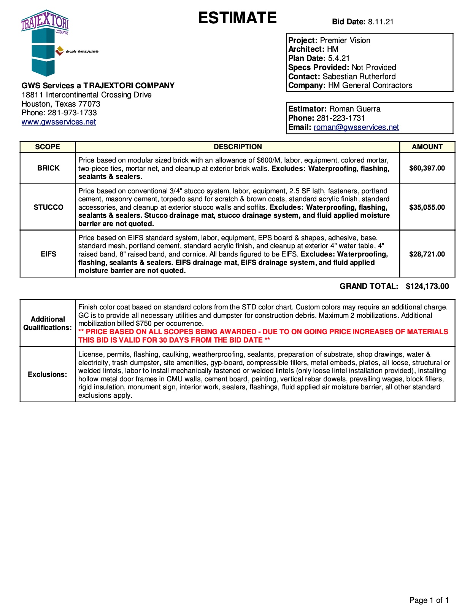
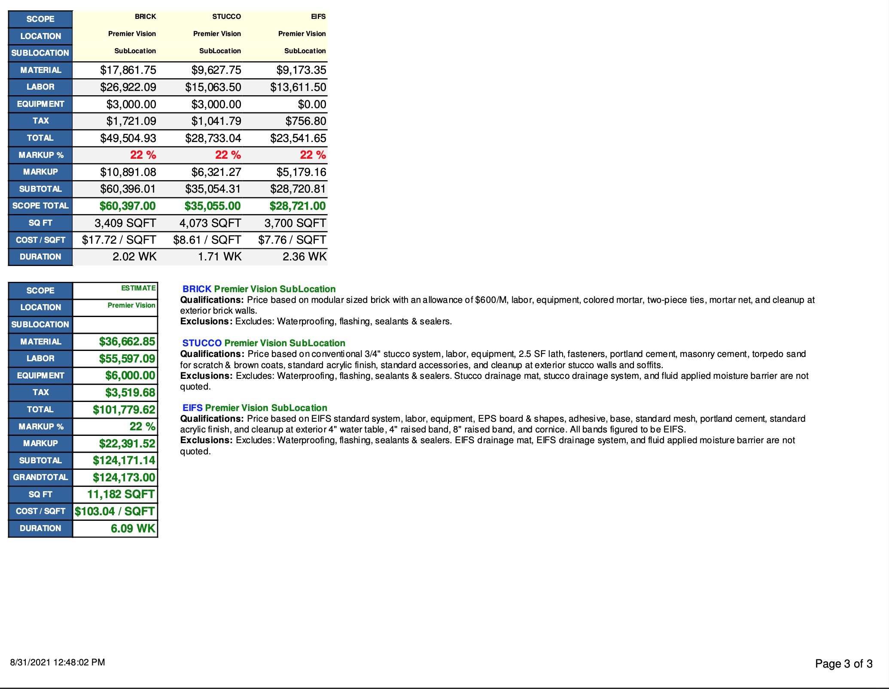

# Pascal Estimate & Reports Code
This is Pascal code that was used to create estimates and reports in PlanSwift's FastReport for a commercial masonry company. The code adds items used in takeoffs by their construction division into an array, and adds up the direct cost to the subtotal.  After calculating the subtotal, a function applies the indirect cost into the elements of the array to calculate the grand total. This code is used to create two different reports. An estimate, and a detailed estimate report. The estimate created were used to send out for bids on projects by given out by general contractors, and the detailed estimate report was used for internal business operations.

# What I learned
* Programming in Pascal.
* Creating code that is scalable.
* Real-life examples can help solve computer problems. Imagine adding brick to a wall, but starting from the top down. That is how the function used to build the cells in the code works.

# Estimate Example

# Report Example

